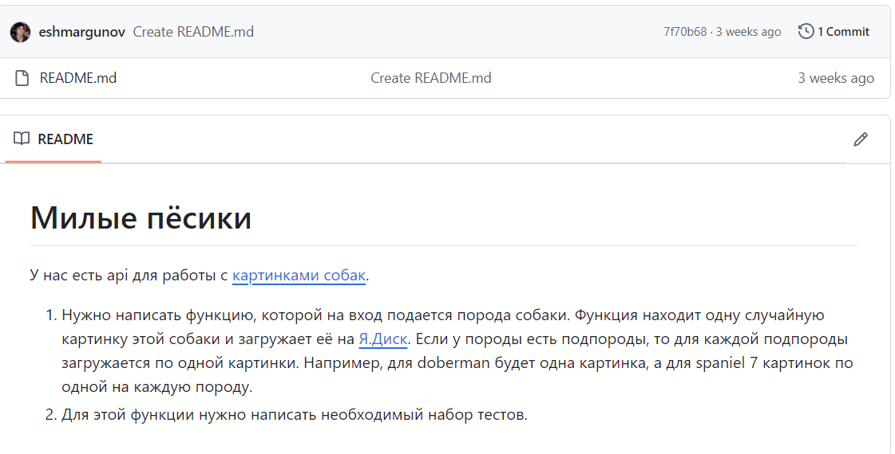

Тестовое задание для Ozon Bank. Выполнил Ришат Ш. (тг @TheRishat)

Постановка задачи тут https://github.com/eshmargunov/tech_intreview_full_task

В файле application.properties надо проставить свое значение oauth.token, чтобы была возможность успешно запускать авотесты на своей учетной записи Яндекс диска.

p.s: Автотесты создают директории и файлы на Яндексе диске, но чтобы тебе не было страшно запускать их на своей учетке, ничего не удаляют после работы.